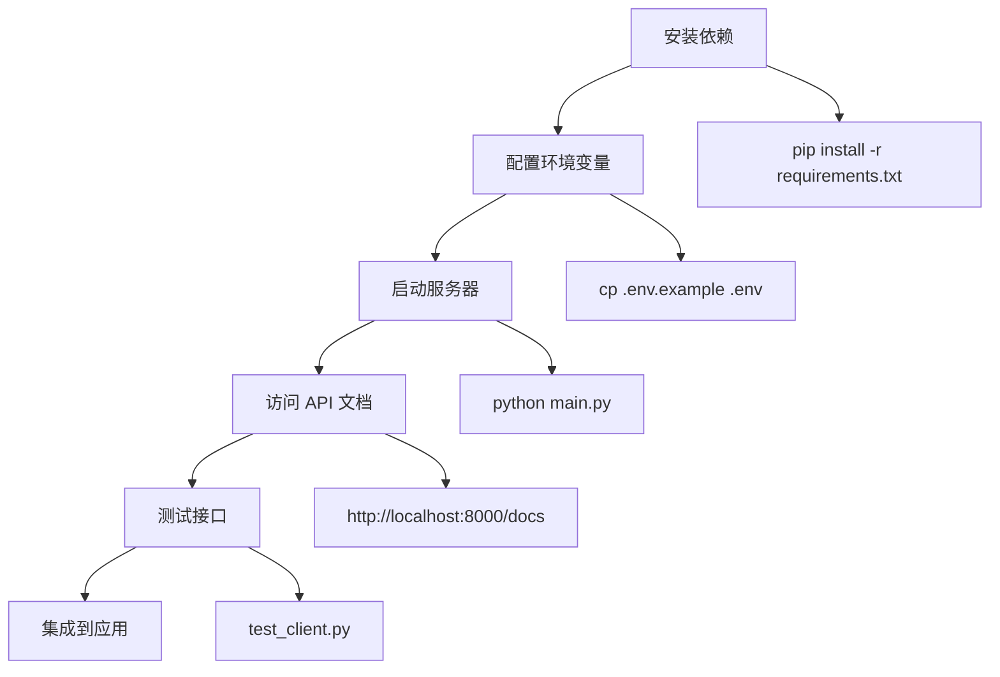

# 🚀 EverMemOS Memory Server - 项目总览

## 📁 项目文件结构

```
server/
├── 📄 main.py                  # 主服务器（FastAPI 应用）
├── 📦 requirements.txt         # Python 依赖包列表
├── ⚙️  .env.example            # 环境变量配置模板
├── 🚫 .gitignore              # Git 忽略文件配置
├── 📖 README.md               # 英文使用文档
├── 📖 快速开始.md             # 中文快速开始指南
├── 🐧 start.sh                # Linux/Mac启动脚本
├── 🪟 start.bat               # Windows 启动脚本
├── 🧪 test_client.py          # 基础测试客户端
├── 🔧 advanced_client.py      # 高级客户端示例
├── 📮 postman_collection.json # Postman API 集合
└── 📊 项目概览.md             # 本文件
```

## 🎯 核心功能

### 1️⃣ 存储记忆接口
- **端点**: `POST /memories/store`
- **功能**: 为指定用户存储一段记忆到 EverMemOS
- **特点**: 
  - 支持自定义消息 ID、时间戳、发送者信息
  - 自动关联用户 ID
  - 可选的组 ID 分类

### 2️⃣ 批量查询接口
- **端点**: `POST /memories/batch-query`
- **功能**: 一次性查询多个用户的多个问题
- **特点**:
  - 支持批量操作，减少网络往返
  - 每个查询独立处理，互不影响
  - 返回匹配的记忆数量统计

### 3️⃣ 健康检查接口
- **端点**: `GET /health`
- **功能**: 检查服务器运行状态
- **特点**: 快速诊断服务可用性

## 🔧 技术栈

| 组件 | 版本 | 说明 |
|------|------|------|
| **框架** | FastAPI 0.104.1 | 现代高性能 Web 框架 |
| **服务器** | Uvicorn 0.24.0 | ASGI 服务器 |
| **数据验证** | Pydantic 2.5.0 | 请求/响应数据验证 |
| **记忆服务** | EverMemOS 0.1.0 | 记忆存储和查询 |
| **环境管理** | python-dotenv 1.0.0 | 环境变量加载 |

## 🏃 快速开始流程



## 📝 使用场景示例

### 场景 1: 用户偏好存储
```python
# 存储用户喜好
POST /memories/store
{
  "user_id": "alice",
  "memory": {
    "content": "喜欢喝黑咖啡，不加糖"
  }
}
```

### 场景 2: 个性化推荐查询
```python
# 批量查询用户偏好用于推荐
POST /memories/batch-query
{
  "queries": [
    {"user_id": "alice", "query": "饮料偏好"},
    {"user_id": "bob", "query": "食物喜好"}
  ]
}
```

### 场景 3: 用户画像构建
```python
# 查询用户的多维度信息
queries = [
    {"user_id": "alice", "query": "饮食习惯"},
    {"user_id": "alice", "query": "作息时间"},
    {"user_id": "alice", "query": "兴趣爱好"}
]
```

## 🔌 客户端集成方式

### 方式 1: 直接使用 HTTP 请求
```bash
curl -X POST http://localhost:8000/memories/store \
  -H "Content-Type: application/json" \
  -d '{"user_id": "user1", "memory": {...}}'
```

### 方式 2: Python 客户端
```python
from advanced_client import MemoryClient
client = MemoryClient()
client.store_memory("user1", "记忆内容")
```

### 方式 3: Postman
导入 `postman_collection.json` 即可使用预配置的请求

## 🛠️ 开发工具

### 测试工具
- ✅ `test_client.py` - 自动化测试所有接口
- ✅ `advanced_client.py` - 高级用法示例
- ✅ Swagger UI - 交互式 API 文档
- ✅ Postman Collection - API 测试集合

### 启动脚本
- ✅ `start.sh` - Unix/Linux/Mac一键启动
- ✅ `start.bat` - Windows 一键启动

### 配置文件
- ✅ `.env.example` - 配置模板
- ✅ `.gitignore` - Git 忽略规则

## 📊 API 性能特性

| 特性 | 说明 |
|------|------|
| **异步处理** | 基于 async/await，高并发友好 |
| **批量操作** | 减少网络往返，提升效率 |
| **错误隔离** | 批量查询中单个失败不影响其他 |
| **类型安全** | Pydantic 提供完整的数据验证 |
| **自动文档** | 自动生成 OpenAPI/Swagger 文档 |

## 🔒 最佳实践建议

### 1. 生产环境部署
```bash
# 使用 gunicorn 管理多进程
gunicorn main:app \
  --workers 4 \
  --worker-class uvicorn.workers.UvicornWorker \
  --bind 0.0.0.0:8000
```

### 2. 环境变量管理
```bash
# .env 文件（不要提交到 Git）
EVERMEMOS_API_KEY=sk-xxx  # 使用真实密钥
DEFAULT_GROUP_ID=production
```

### 3. 日志记录
```python
# 添加 logging
import logging
logging.basicConfig(level=logging.INFO)
logger = logging.getLogger(__name__)
```

### 4. 错误处理
```python
try:
    response = memory_service.add(**data)
except Exception as e:
    logger.error(f"存储失败：{e}")
    raise HTTPException(status_code=500, detail=str(e))
```

## 📈 扩展方向

### 功能扩展
- [ ] 添加用户认证（JWT/OAuth2）
- [ ] 实现记忆删除/更新接口
- [ ] 添加记忆分类和标签
- [ ] 支持模糊搜索和过滤
- [ ] 实现记忆统计分析

### 性能优化
- [ ] 添加 Redis 缓存层
- [ ] 实现请求限流
- [ ] 添加数据库连接池
- [ ] 实现异步批量处理
- [ ] 添加监控和告警

### 安全加固
- [ ] API Key 轮换机制
- [ ] 请求签名验证
- [ ] CORS 配置
- [ ] HTTPS 强制
- [ ] SQL 注入防护

## 🐛 故障排查

### 常见问题速查

| 问题 | 可能原因 | 解决方案 |
|------|---------|---------|
| 服务器无法启动 | 端口被占用 | 修改 PORT 或关闭占用进程 |
| ImportError | 依赖未安装 | `pip install -r requirements.txt` |
| API Key 错误 | 配置不正确 | 检查.env 中的 EVERMEMOS_API_KEY |
| 连接超时 | 网络问题 | 检查 EverMemOS 服务状态 |
| 422 错误 | 数据格式错误 | 检查请求体字段是否符合 schema |

## 📚 学习资源

- **FastAPI 官方文档**: https://fastapi.tiangolo.com/
- **EverMemOS 文档**: 查看官方资料
- **Pydantic 文档**: https://docs.pydantic.dev/
- **Uvicorn 文档**: https://www.uvicorn.org/

## 🎓 下一步行动

1. ✅ 阅读 `快速开始.md` 了解详细用法
2. ✅ 运行 `python test_client.py` 测试功能
3. ✅ 查看 `advanced_client.py` 学习高级用法
4. ✅ 访问 http://localhost:8000/docs 查看交互文档
5. ✅ 根据业务需求定制开发

---

**版本**: 1.0.0  
**创建时间**: 2026-03-08  
**许可**: MIT  
